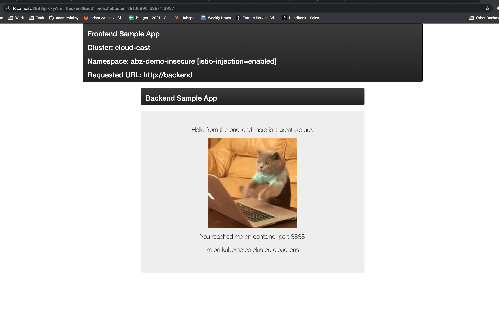
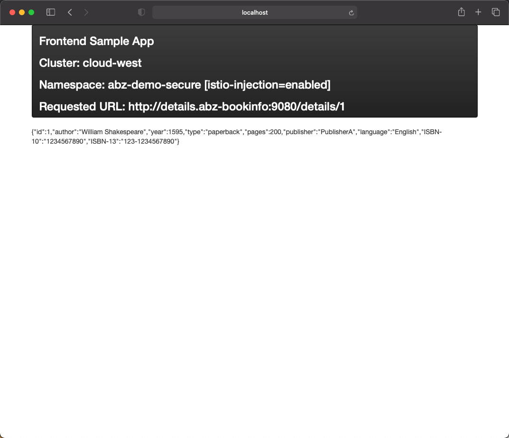
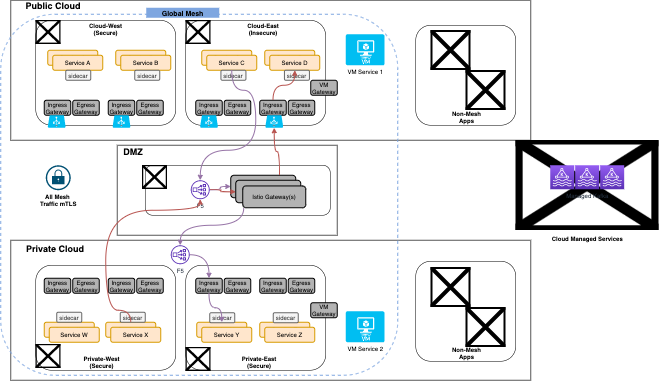

# Overview
The first step will be to deploy all our sample applications. As a reminder, we'll be working with 3 applications:
1. Insecure App
2. Secure App
3. Bookinfo App

The steps to deploy the applications are largely identical; the main change will be ensuring that you are targeting the correct kubernetes cluster in your kube context file.

## Application Deployment
Prior to installing ensure you have set an environment variable in the shell you are using named `PREFIX`.  The value you should use will be provided to you by Tetrate.  This will be used to prefix common objects, such as namespaces, dns entries, TSB tenants and workspaces, etc such that your appliations and configuration will not collide with others running this workshop on shared infrastructure.

```bash
export PREFIX=abz
```

### Insecure Application
The insecure application is comprised of a frontend and a backend service plus an Istio IngressGateway, all deployed to a dedicated namespace.  Ensure your kube context is targeted the `public cloud east` cluster.  Deploy the applications and Istio IngressGateway using `kubectl`.

To check for current workspace excute the command kubectx

```bash
kubectx
```

You should see a sample output as shown below 
```bash
default/api-oc-ms-demo-east-cx-tetrate-info:6443/kube:admin
default/api-oc-ms-demo-west-cx-tetrate-info:6443/kube:admin
gke_abz-env_us-east4_dmz
gke_abz-env_us-east4_public-east-4
gke_abz-env_us-west1_public-west-4
```
The context that is active will be highlighted.

```bash
envsubst < 00-App-Deployment/cloud-east/app.yaml | kubectl apply -f -
envsubst < 00-App-Deployment/cloud-east/cluster-ingress-gw.yaml | kubectl apply -f -
```

While the application starts up, lets inspect the 2 items that introduce this application into the global service mesh.  
1. Inspect the file `00-App-Deployment/cloud-east/app.yaml`.  You'll note our namespace has a label enabling Istio for any application pods.
```yaml
---
apiVersion: v1
kind: Namespace
metadata:
  name: $PREFIX-demo-insecure  
  labels:
    istio-injection: enabled # This label will causes our application pods to receive an envoy sidecar container
...
```

2. Inspect the file `00-App-Deployment/cloud-east/cluster-ingress-gw.yaml`.  This is a Tetrate-specific `CustomResourceDefinition` that will deploy and optimally configure a dedicated Istio `IngressGateway` for the applictions in this namespace.
```yaml
---
apiVersion: install.tetrate.io/v1alpha1
kind: IngressGateway
metadata:
  name: $PREFIX-tsb-gateway
  namespace: $PREFIX-demo-insecure
spec:
  kubeSpec:
    service:
      type: LoadBalancer
      annotations:
        "external-dns.alpha.kubernetes.io/hostname": "insecure.public.$PREFIX.cloud.zwickey.net."
...
```

Though this YAML file is fairly terse and simple, a lot was configured under the covers.  The Tetrate platform will translate this request into an `IstioOperator` deployment of an Istio `IngressGateway`.  You can view this configuration by executing:
```bash
kubectl get istiooperator -n istio-gateway tsb-gateways -o yaml
```

By now our application should be running and pods/services introduced into the global service mesh.  We even have an Istio `IngressGateway` bound to an external load balancer and DNS entry (via `external-dns`).  However, we have not deployed any mesh configuration yet so our application will not be accessible external from the mesh.  For now we can verify our application is running and functioning properly in the mesh by port-forwarding.  

First, lets find the external IP address assigned by AWS to your jumpbox by curling the metadata endpoint exposed locally.  You will use this address when you open a browser window.

```bash
curl http://169.254.169.254/latest/meta-data/public-ipv4
```

Then setup the port-forwarding
```bash
kubectl port-forward -n $PREFIX-demo-insecure $(kubectl get po -n $PREFIX-demo-insecure --output=jsonpath={.items..metadata.name} -l app=frontend) --address 0.0.0.0 8888:8888
```

Open your browser and navigate to `<JUMPHOST EXTERNAL IP>:8888`.  Enter `backend` in the Backend HTTP URL text box and submit the request.  This will cause the frontend microservice to call to the backend microservice over the service mesh and return the display the response via the frontend app.



You may now choose to close the port forward in the shell by pressing Ctrl-C . If you do not choose to do this please ensure that you choose a different port ( port other than 8888 ) for  port forwarding in the Secure Application example below.

### Secure Application
The secure application is identical to the insecure application, with the exceeption that it is deployed to 3 different kubernetes clusters that are part of a different trust domain.  

1 - Ensure your kube context is targeted the `public cloud west` cluster.  Deploy the application the appliction and Istio IngressGateway using `kubectl`. If you do not know how to change context follow the steps below.
execute the command
```bash
kubectx
```

Search for the entry containing public and west . Now with that entry execute the command
```bash
kubectx gke_abz-env_us-west1_public-west-4
```
In my case the context containing west and public was gke_abz-env_us-west1_public-west-4 . Please replace with your entry.

Having changed the context . You may now execute the following commands.

```bash
envsubst < 00-App-Deployment/cloud-west/app.yaml | kubectl apply -f -
envsubst < 00-App-Deployment/cloud-west/cluster-ingress-gw.yaml | kubectl apply -f -
```
I DO NOT SEE AN PRIVATE EAST CLUSTER ?????????

2 - Ensure your kube context is targeted the `private east` cluster.  Deploy the application the appliction and Istio IngressGateway using `kubectl`.
```bash
envsubst < 00-App-Deployment/private-east/app.yaml | kubectl apply -f -
envsubst < 00-App-Deployment/private-east/cluster-ingress-gw.yaml | kubectl apply -f -
```

3 - Ensure your kube context is targeted the `private west` cluster.  Deploy the application the appliction and Istio IngressGateway using `kubectl`.
```bash
envsubst < 00-App-Deployment/private-west/app.yaml | kubectl apply -f -
envsubst < 00-App-Deployment/private-west/cluster-ingress-gw.yaml | kubectl apply -f -
```

You can verify the secure verison of the application utilizing the same method of `kubectl port-forward` described in the previous sectionn but only change the namespace you are targeting with the command.

### Bookinfo Application
The bookinfo application is also going to be deployed to the 2 private cloud kubernetes clusters that are part of the "Secure" zone.

1 - Ensure your kube context is targeted the `private cloud east` cluster.  Deploy the application the appliction and Istio IngressGateway using `kubectl`.

```bash
envsubst < 00-App-Deployment/private-east/bookinfo-multicluster.yaml | kubectl apply -f -
```

If you inspect the deployment file `00-App-Deployment/private-east/bookinfo-multicluster.yaml` you'll note that this created a bookinfo namespace, deployed the bookinfo microservices, and also created an Istio IngressGateway.  

Since we have not made any mesh configurations we cannot consume our service externally.  However, we can use the frontend of the secure sample app we previously deployed to test the bookend details service.  Execute the same command as before to port-forward:

```bash
kubectl port-forward -n $PREFIX-demo-secure $(kubectl get po -n $PREFIX-demo-secure --output=jsonpath={.items..metadata.name} -l app=frontend) --address 0.0.0.0 8888:8888
```

Open your browser and navigate to `<JUMPHOST EXTERNAL IP>:8888`.  This time enter `details.<PREFIX>-bookinfo:9080/details/1` in the Backend HTTP URL text box and submit the request.  Replace `<PREFIX>` with the value you have been using during this workshop for your env prefix.  This will cause the frontend microservice to call to the details microservice over the service mesh and return the display the response via the frontend app.



2 - Follow the exact same process to deploy the full application into the private west cluster.  Ensure your kube context is targeted the `private west` cluster.  Deploy the application the appliction and Istio IngressGateway using `kubectl`.

```bash
envsubst < 00-App-Deployment/private-west/bookinfo-multicluster.yaml | kubectl apply -f -
```

You can verify the application utilizing the same method of `kubectl port-forward` described in the previous section.  You can call the details service as a backend or view the Bookinfo UI by entering `productpage.<PREFIX>-bookinfo:9080`

### DMZ Gateways Deployment
Lastly, in preparation for connecting our private clusters with clusters in the public cloud securely via a DMZ cluster that is also part of the global service mesh, we will deploy a gateway to facilitate this mesh traffic flow.  



1 - Ensure your kube context is targeted the `DMZ` cluster.  Deploy the application the appliction and Istio IngressGateway using `kubectl`.

```bash
envsubst < 00-App-Deployment/dmz/cluster-t1.yaml | kubectl apply -f -
```
