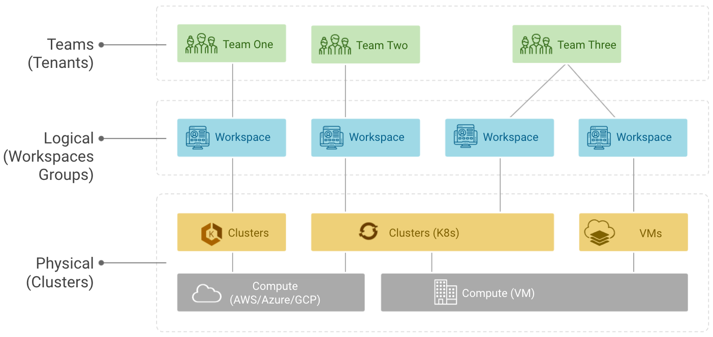

# Overview
Our applications are deployed but we need to create tenancy for our applications within Tetrate Service Bridge.  The Tenant, Workspace(s), and Group(s) that are created will allow us to bind policy and configuration to our applications, controlling application traffic and routing, security, and observability.  The concepts within multi-tenancy are also where we bind the logical concepts of an Application and associated mesh configuration to physical compute infrastructure.



As we ensured with our privous lab, prior to continuing ensure you have set an environment variable in the shell you are using named `PREFIX`.  You will also want to ensure that your `tctl` CLI is targeted and logged into the TSB management plane.

```bash
export PREFIX=abz

tctl config clusters set default --bridge-address <TSB-MGMT-PLANE-ADDRESS>:443
tctl login --org tetrate --tenant $PREFIX-tetrate --username <TSB-USER> --password <TSB-PWD>
```

## Create Tenants
Since a `Tenant` is at the top of the multi-tenancy hierarchy, that is the first object we will be created.  You will be creating/configuring a tenant that will be dedicated to your applications and namespaces.  The configuration is deployed to TSB using the `tctl apply` command:

```bash
envsubst < 01-Tenancy/01-tenant.yaml | tctl apply -f -  
```

Lets take a close look at the API Objects that defined the `Tenant`.

1. Inspect the file `01-Tenancy/01-tenant.yaml`.  This API Object is about as simple as it gets; the `organization` and `name` fields are the most relevant as these uniquely identify the tenant.
```yaml
---
apiVersion: api.tsb.tetrate.io/v2
kind: Tenant
metadata:
  organization: tetrate
  name: $PREFIX-tetrate
spec:
  description: $PREFIX-tetrate
  displayName: $PREFIX-tetrate
```

2. You'll also note that there is a second API Object which configures some basic RBAC on the tenant.  This object configures the unique `Team` that your user is a part of as an admin of this `Tenant`.

```yaml
---
apiVersion: rbac.tsb.tetrate.io/v2
kind: TenantAccessBindings
metadata:
  organization: tetrate
  tenant: abz-tetrate
spec:
  allow:
  - role: rbac/admin
    subjects:
    - team: organizations/tetrate/teams/$PREFIX
```

## Create Workspaces
Next we will create a few different `Workspaces` that will model the various applications that we have already deployed in the first lab.  Remember that we've already deployed these apps:
1. Insecure App
2. Secure App
3. Bookinfo App

Additionally, we will create a workspace that will contain the DMZ policy for cross-cloud traffic.  Apply the configuration using the `tctl`:

```bash
envsubst < 01-Tenancy/02-workspace.yaml | tctl apply -f -  
```

Lets inspect the workspace configuration applied in more detail.  Each workspace is nearly identical; though obviously meta-data such as *name* need to be unique.  `Workspaces` also have a parent `Tenant`.  Additionally, workspaces are the construct that maps the logical multi-tenancy constructs of TSB to the physical infrastructure.  This is done via selectors that are made up of a cluster/namespace tuple.  Wildcards are also supported.  Inspect the file `01-Tenancy/02-workspace.yaml` to understand this mapping.

```yaml
---
apiversion: api.tsb.tetrate.io/v2
kind: Workspace
metadata:
  tenant: $PREFIX-tetrate
  organization: tetrate
  name: $PREFIX-insecure-app
spec:
  description: $PREFIX-insecure-app
  displayName: $PREFIX-insecure-app
  namespaceSelector:
    names:
      - "*/$PREFIX-demo-insecure"
```

## Create Workspace Groups
Lastly we'll create `Groups`, which is the contstruct within the TSB multi-tenancy model that contains service mesh configuration for an application.  For now we'll only create a set of `Traffic Groups`, which is the bear minumim needed to expose our services via the ingress gateway we have already deployed.  The configuration is deployed to TSB using the `tctl apply` command:

```bash
envsubst < 01-Tenancy/03-group.yaml | tctl apply -f -
```

Open the file `01-Tenancy/03-group.yaml` and view the `Group` definitions.  You'll note it is similar to our previous API objects we looked at.  It contains metadata that map the object to its parent `Tenant` and `Workspace` plus it offers you the ability to further refine the infrastructure configuration is delivered to using cluster/namespace selectors.

```yaml
---
apiVersion: gateway.tsb.tetrate.io/v2
kind: Group
metadata:
  tenant: $PREFIX-tetrate
  organization: tetrate
  workspace: $PREFIX-insecure-app
  name: insecure-gateway-cloud
spec:
  displayName: insecure-gateway-cloud
  description: insecure-gateway-cloud
  namespaceSelector:
    names:
      - "cloud-east/$PREFIX-demo-insecure"
  configMode: BRIDGED
```

Each of the obects we've created so far have been logical, providing for multi-tenancy and RBAC control.  However, next we will begin configuring our applications within TSB and the global service mesh!