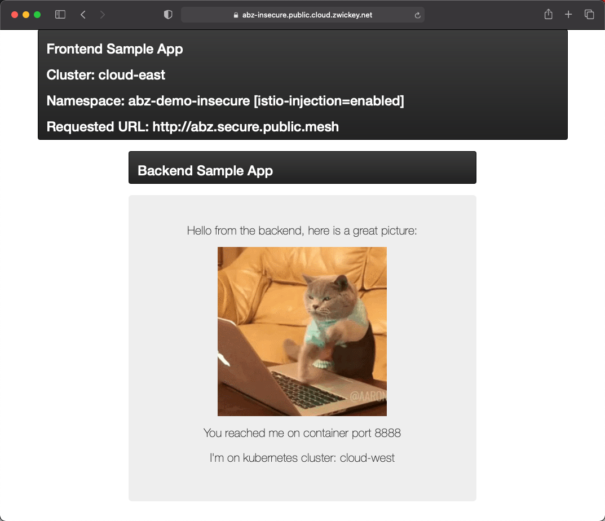

# Overview
Up until this point we have deployed our applications and setup multi-tenancy within TSB.  However, the applications are not accessible external to the Kubernetes clusters and they are not configured to take full advantage of the global service mesh.  Typically within an Istio service mesh, applications must be configured with `Gateways`, `VirtualServices`, `DestinationRules`, and `ServiceEntries` to control traffic.  TSB simplifies this greatly.

## Configuring Applications within TSB
As we ensured with our previous labs, prior to continuing ensure you have set an environment variable in the shell you are using named `PREFIX`.  You will also want to ensure that your `tctl` CLI is targeted and logged into the TSB management plane.

We will be creating nearly identical configurations in all 4 of our application Kubernetes clusters.  Using the `tctl apply` command create a Tetrate `IngressGateway` for each cluster.  Under the covers TSB will create all the needed service mesh configuration objects. Execute the following apply commands and then we'll inspect the configuration a bit further

```bash
envsubst < 02-App-Config/01-tsb-cloud-east.yaml | tctl apply -f -  
envsubst < 02-App-Config/02-tsb-cloud-west.yaml | tctl apply -f -  
envsubst < 02-App-Config/03-tsb-private-east.yaml | tctl apply -f -  
envsubst < 02-App-Config/04-tsb-private-west.yaml | tctl apply -f -  
```

Let's dig into what what was actually configured via TSB and within the global service mesh.  We will use the public cloud west cluster, which is part of the *Secure* application workspace.  Inspect the file `02-App-Config/02-tsb-cloud-west.yaml`

- The first item you'll note is that a set of metadata is provided that maps this `IngressGateway` object to all the relevant multi-tenancy objects; Tenants, Workspaces, and Groups.  If we had configured this via the web UI that metadata would have been picked up automatically.

```yaml
---
apiVersion: gateway.tsb.tetrate.io/v2
kind: IngressGateway
metadata:
  name: secure-gateway
  group: secure-gateway-cloud
  workspace: $PREFIX-secure-app
  tenant: $PREFIX-tetrate
  organization: tetrate
...  
```

- Secondly, you'll note there is a small `workloadSelector` fragment that will map the service mesh gateway objects to the deploy gateway(s), which are Envoy proxies.  
```yaml
...
workloadSelector:
  namespace: $PREFIX-demo-secure
  labels:
    app: $PREFIX-tsb-gateway
...  
```

You can easily verify that this maps to the correct Envoy gateway pod using a simple `kubectl command`.  Ensure your kubecontext is pointed at the public cloud west cluster.  Take note of the patching `app=` label.

```bash
kubectl --context public-west get po -n $PREFIX-demo-secure -l istio=ingressgateway --show-labels
```

```bash
NAME                               READY   STATUS    RESTARTS   AGE   LABELS
abz-tsb-gateway-6dd848764b-xwplw   1/1     Running   0          21h   app=abz-tsb-gateway,install.operator.istio.io/owning-resource=unknown,istio.io/rev=default,istio=ingressgateway,operator.istio.io/component=IngressGateways,pod-template-hash=6dd848764b,service.istio.io/canonical-name=abz-tsb-gateway,service.istio.io/canonical-revision=latest
```

- Lastly, you'll see the definition of the ingress endpoints for both the frontend and backend applications.  Pay particular note to the FQDNs at which the services are exposed.  The frontend application is exposed at a FQDN that is publicly resolvable.  Additionally, it is exposed on 443 for TLS along with a valid certificate specified.  Conversely, the backend is exposed via a FQDN that is not public, `secure.$PREFIX.public.mesh`.  This is because it is for *internal mesh traffic* and will only be resolvable by services within the global mesh.  Additionally, and external certificate for TLS communication is not necessary as the global mesh will automatically encrypt all inter-mesh traffic.  

Now lets test our applications!

## Configuring Applications within TSB
We have deployed our services across 4 clusters -- 2 public cloud clusters and 2 private cloud clusters.  The following table lists the internal and/or external endpoints of all the services.  `$PREFIX` should be replaced with value of your PREFIX env variable you have been using throughout this workshop.

| Cluster      | Application | External Address | Internal Address |
| ----------- | ----------- | ----------- | ----------- |
| Public Cloud East (Insecure)   | frontend        | insecure.public.$PREFIX.cloud.zwickey.net        | N/A        |
|  | backend        | N/A        | insecure.$PREFIX.public.mesh        |
| Public Cloud West (Secure)   | frontend        | secure.public.$PREFIX.cloud.zwickey.net        | N/A        |
|  | backend        | N/A        | secure.$PREFIX.public.mesh        |
| Private Cloud East (Secure)   | frontend        | secure.east.private.$PREFIX.cloud.zwickey.net       | N/A        |
|  | backend        | N/A        | east.secure.$PREFIX.private.mesh     |
| Private Cloud West (Secure)   | frontend        | secure.west.private.$PREFIX.cloud.zwickey.net       | N/A        |
|  | backend        | N/A        | west.secure.$PREFIX.private.mesh        |

Open your browser and navigate to https://insecure.public.$PREFIX.cloud.zwickey.net.  Make sure you replace $PREFIX in the URL with your prefix value.  The application should display in your browser.  Enter the internal address for the backend running in the public cloud east cluster -- `insecure.$PREFIX.public.mesh`.  This will cause the frontend microservice to call to the details microservice over the service mesh and return the display the response via the frontend app.  

Click that back button and this time enter the internal address for the backend running in the *public cloud west* Cluster -- `secure.$PREFIX.public.mesh`.  The frontend application will use global service discovery to find the application running in a completely different kubernetes cluster.  It will then utilize the mesh to route securely via mTLS to call the backend service in the cluster.  The reponse you see in the frontend application UI will confirm which cluster responded to the frontend.



How did this work?  Well explore the configuration pushed out to our `public-east` cluster, which is where the frontend application you tested with is running.  You can view the global config that was automatically distributed across the mesh by executing the following command to show `ServiceEntries` that were created.  This configuration instructs the frontend's service mesh sidecar how to connect to the backend running on a different cluster.

```bash
kubectl --context public-east describe serviceentries.networking.istio.io -n xcp-multicluster gateway-secure-$PREFIX-public-mesh  
```

```bash
...
Spec:
  Endpoints:
    Address:  104.196.241.233
    Labels:
      Network:                     cloud
      security.istio.io/tlsMode:   istio
      xcp.tetrate.io/cluster:      cloud-west
      xcp.tetrate.io/hops:         0
      xcp.tetrate.io/serviceType:  remoteGateway
    Locality:                      us-west1
    Ports:
      Http:  15443
  Export To:
    *
  Hosts:
    $PREFIX.secure.public.mesh
  Location:  MESH_INTERNAL
  Ports:
    Name:      http
    Number:    80
    Protocol:  HTTP
  Resolution:  STATIC
...
```

Lastly, one more time click that back button and this time enter the internal address for the backend running in one of the *private cloud* Clusters -- `west.secure.$PREFIX.private.mesh`.  This time the frontend will fail.  Why is that?  We have not configured the DMZ to facilitate communication that transits through the DMZ, which is needed for Public->Private cloud communication (or visa versa).  We'll configure that in the next lab.

Additionally, at this point you may be wondering why the *insecure* app was able to communicate with the *secure* app.  Shouldn't this be prohibited?  Absolutely!  Our application workspaces for both the secure and insecure applications were purposefully configured with no default policy for global mesh authentication and authorization.  We'll also lock down our secure apps in the next lab.
