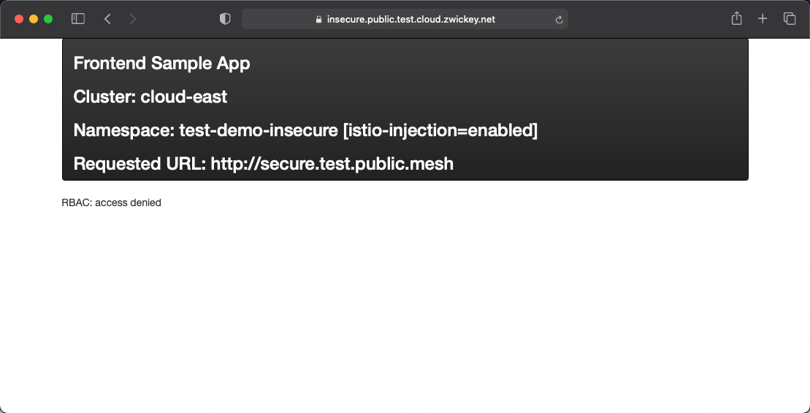
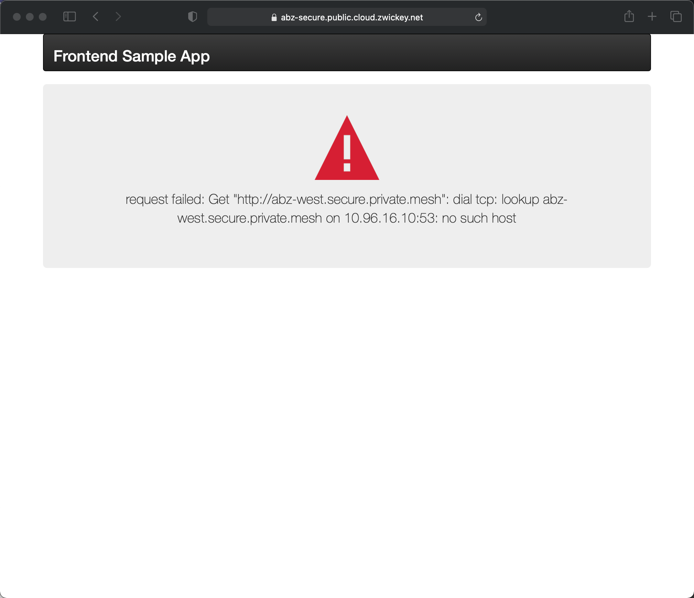
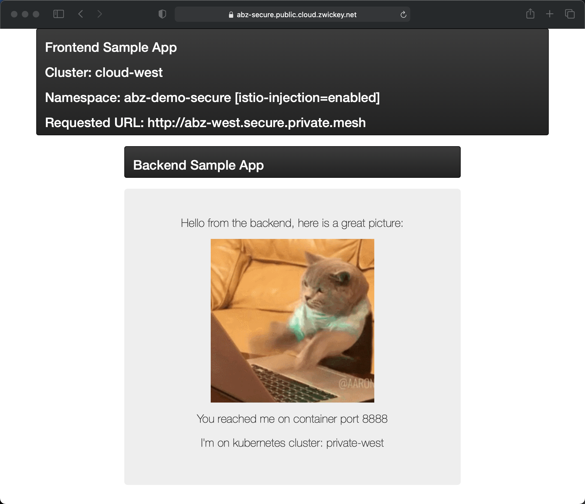

# Overview
As we saw in the previous lab, after we deployed configuration that exposed our Frontend and Backend applications via the service mesh still had 2 issues:
1. The Public Cloud services were not able to talk to the Private Cloud services and visa versa.
2. The *Secure* applications were not actually secure.  The *Insecure* application could communicate freely with *Secure* services.

We will configure global mesh policy to correct these issues

## Configuring AuthN/Z for Secure App(s)
Our application workspace for the secure applications does not contain any policy for service to service authenticaiton or authorization (AuthN/Z).  Within TSB establishing this default policy is a trivial task.  First, ensure you have set an environment variable in the shell you are using named `PREFIX`.  You will also want to ensure that your `tctl` CLI is targeted and logged into the TSB management plane.

1.  Create a default `WorkspaceSetting` that will apply to the Secure Application workspace using `tctl apply`:

```bash
envsubst < 03-Security/01-workspace-setting.yaml | tctl apply -f -   
``` 

Inspect the file `03-Security/01-workspace-setting.yaml`.  As you may expect, the metadata section contains the names and IDs that map the `WorkspaceSetting` to the Secure application's workspace. However, the important piece is the `defaultSecuritySetting`

```yaml
defaultSecuritySetting:
  authenticationSettings:
    trafficMode: REQUIRED
  authorization:
    mode: WORKSPACE
``` 

This will configure *all* services deployed to any cluster that is part of the Secure workspace to require strict mTLS authentication.  Additionally, and more importantly, it will also configure mTLS authorization that only allows services within the Secure `Workspace` to connect.

2.  Lets now verify that our changes had the desired affect.  Once again open your browser and navigate to https://insecure.public.$PREFIX.cloud.zwickey.net.  Make sure you replate $PREFIX in the URL with your prefix value.  Enter the internal address for the secure backend running in the public cloud west cluster -- `secure.$PREFIX.public.mesh`.  This will cause the frontend microservice to attempt to call the secure backend.  However, you should receive an `RBAC: Access Denied` message, which is an http 403 response.  We've successfully added policy to block insecure -> secure app communication.    



## Enabling Cross-Cloud communication via DMZ
As we demonstrated previously, the Frontend application running in a public cloud cluster is not able to talk to any application services running in a private cloud cluster.  We will create an Allow-List for this communication in the DMZ in this portion of the lab.  But first, lets verify one more time that the Frontend application running in the Public Cloud West cluster, which is part of the Secure workspace, is unable to discover and communicate with the backend running in the the Private Cloud West cluster.  

Open your browser and navigate to https://secure.public.$PREFIX.cloud.zwickey.net.  Make sure you replate $PREFIX in the URL with your prefix value.  The application should display in your browser.  Enter the internal address for the backend running in the private west cluster -- `west.secure.$PREFIX.private.mesh`.  This should result in an error:



Create the policy and configuration that will apply to the Secure Application workspace using `tctl apply`:

```bash
envsubst < 03-Security/02-dmz-policy-config.yaml | tctl apply -f -   
``` 

Inspect the file `03-Security/02-dmz-policy-config.yaml`.  As you may expect, the metadata section contains the names and IDs that map the `WorkspaceSetting` to a specific `Tenant`, `Workspace`, and `GatewayGroup`. The key is the definition of a set of `internalServers` that represent the endpoints that will be allowed to traverse through the DMZ gateway. 

```yaml
internalServers:
  - hostname: east.secure.$PREFIX.private.mesh
    name: east-private
  - hostname: west.secure.$PREFIX.private.mesh
    name: west-private
``` 

It will take a few seconds for the config to get distributed to all the clusters.  Click the back button, which will ensure you don't get a cached page, and try the request again.  You should now receive a response from the Backend application running in the Private West cluster.



If you really want to dig into the details of how this worked, we can look into the `ServiceEntries` that were distributed across the global mesh. 

1.  First change your kubecontext to the Public Cloud West cluster.  Look at the `ServiceEntry` that was distirbued that facilitiated the Public Cloud -> DMZ communication using the `kubectl describe` command:
```bash
kubectl describe se -n xcp-multicluster gateway-west-secure-$PREFIX-private-mesh
```
```yaml
Spec:
  Endpoints:
    Address:  35.245.211.33
    Labels:
      Network:                     dmz
      security.istio.io/tlsMode:   istio
      xcp.tetrate.io/cluster:      dmz
      xcp.tetrate.io/hops:         1
      xcp.tetrate.io/serviceType:  remoteGateway
    Locality:                      dmz
    Ports:
      Http:  15443
  Export To:
    *
  Hosts:
    west.secure.abz.private.mesh
  Location:  MESH_INTERNAL
  Ports:
    Name:      http
    Number:    80
    Protocol:  HTTP
  Resolution:  STATIC
```

You'll note that the mesh configuration delivered the to the Public Cloud West clusters identifies the route for `west.secure.$PREFIX.private.mesh` (`west.secure.abz.private.mesh` in my example) to connect via a `remoteGateway` located in a `network` that we've tagged as DMZ in our topology, and it will transit via a mesh internal port of `15443` via mTLS communication.

- Now change your kubecontext to the DMZ cluster and look at the same `ServiceEntry` using the exact same `kubectl describe` command:
```bash
kubectl describe se -n xcp-multicluster gateway-west-secure-$PREFIX-private-mesh
```
```yaml
Spec:
  Endpoints:
    Address:  a87ee1f1b4dd040fabc438a08e421f3a-639535762.us-west-1.elb.amazonaws.com
    Labels:
      Network:                     private
      security.istio.io/tlsMode:   istio
      xcp.tetrate.io/cluster:      private-west
      xcp.tetrate.io/hops:         0
      xcp.tetrate.io/serviceType:  remoteGateway
    Locality:                      us-west-1
    Ports:
      Http:  15443
  Export To:
    *
  Hosts:
    west.secure.abz.private.mesh
  Location:  MESH_INTERNAL
  Ports:
    Name:      http
    Number:    80
    Protocol:  HTTP
  Resolution:  DNS
```

The mesh configuration delivered to the DMZ Cluster is very similar, except it knows how to forward traffic for the route `west.secure.$PREFIX.private.mesh` to the remote gateway on the private network; still using mTLS over port 15443.

2.  To explain the last piece of the puzzle, lets take a look `NetworkReachability` that has already been defined in the environment that forces all Cross-Cloud traffic to transit throught he DMZ.  Execute the following `tctl` command:

```bash
tctl get OrganizationSetting tetrate-settings -o yaml 
```

Focus on the `networkReachability` section, which defines the allowed communication paths for the global mesh topology:

```yaml
networkSettings:
  networkReachability:
    cloud: dmz
    dmz: cloud,private
    private: dmz
```

We now have some sensible security policies applied to our Secure Application(s).  Next, lets introduce some VM-based workloads into the global mesh.
