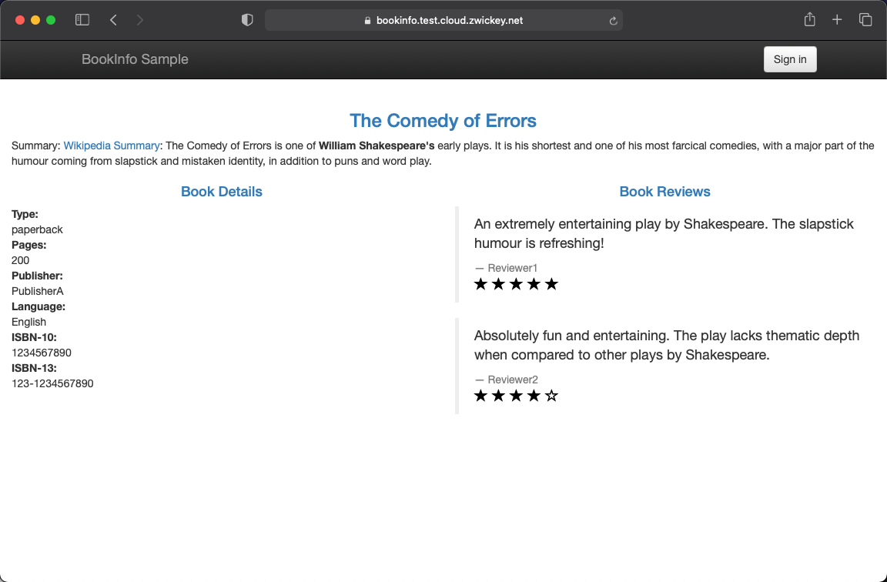
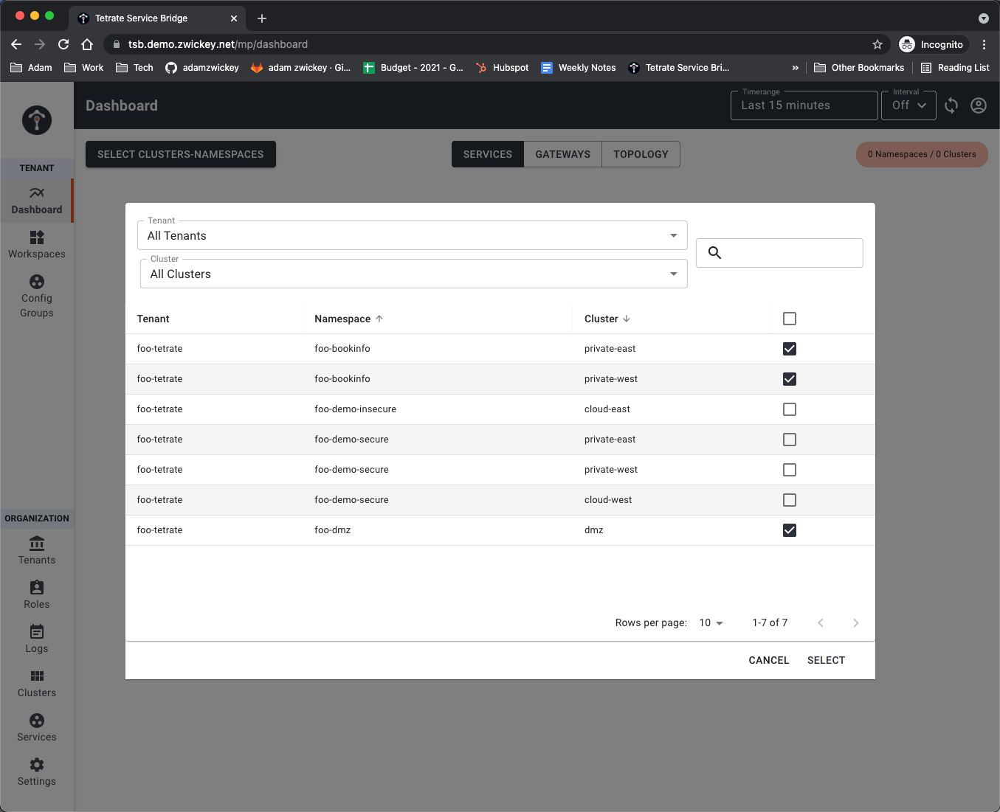
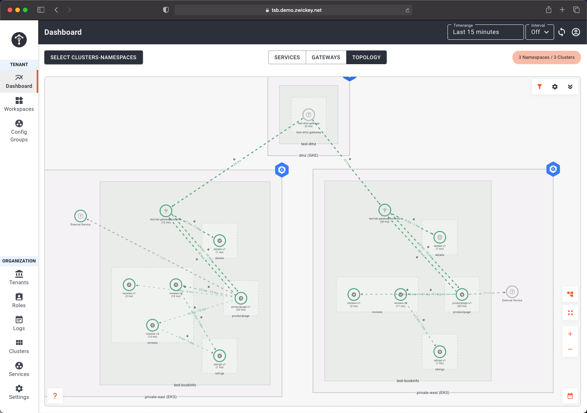
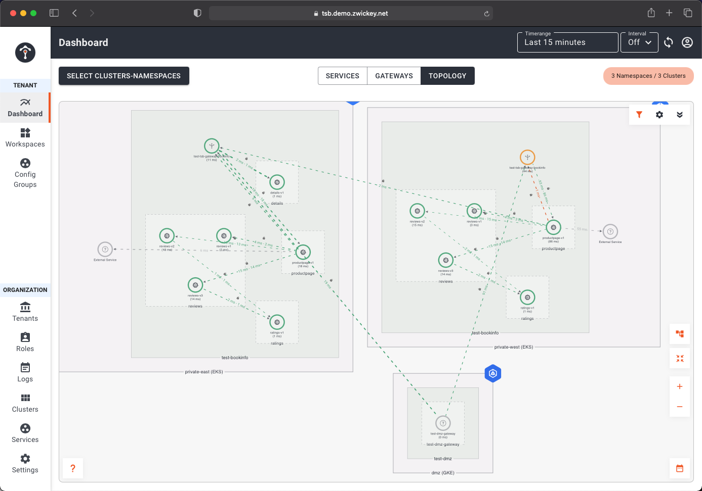

# Overview
Earlier in the workshop we deployed the bookinfo microservice application.  We have this deployed into both the private west and private east clusters.  During this lab we will utilize the Gateway deployed into the DMZ Cluster as a `Tier 1 Gateway`, which is an Ingress Gateway that understands the multi-cluster topology of an application and is able to load balance across instances of the application regardless of what cloud, region, or cluster they are running in.

Additionally, we will demonstrate locale-aware routing.  Even if a microservice is available in multiple clusters, when performing service discovery and routing the mesh will favor a local instance VS crossing cluster (or region) boundaries.  Only in the event of a failure will traffic leave a local cluster.

## Bookinfo Load Balancing

- First we need to apply the TSB IngressGateway configuration for both the `Tier1Gateway` in the DMZ cluster and the `IngressGateway` that is deployed to both the private clusters.  Using the `tctl apply` command create objects.  As with our other lab scenarios, under the covers TSB will create all the needed service mesh configuration objects. Execute the following apply commands and then we'll inspect the configuration a bit further

```bash
envsubst < 05-LB/01-bookinfo.yaml | tctl apply -f - 
envsubst < 05-LB/02-bookinfo-t1.yaml | tctl apply -f -
```

Inspect the file `02-bookinfo-t1.yaml`.  You'll see the expected metadata section that maps to a tenant, workspace, etc and also the workload selector that delivers the config to the deployed Istio Ingress Gateway.  The most important part is the configuration that exposes an `externalServer` with a fqdn (`bookinfo.$PREFIX.cloud.zwickey.net`) with proper TLS termination.

```yaml
externalServers:
  - hostname: bookinfo.$PREFIX.cloud.zwickey.net
    name: bookinfo
    port: 443
    tls:
      mode: SIMPLE
      secretName: bookinfo-certs
```

What you do not see is any configuration that maps this external endpoint configuration to the private clusters in which our application services run.  This is because the Global Service Mesh is intelligent enough to automatically discover and link up upstream services that match this endpoint.  These upstream services are configured in the private clusters via the config we applied from `05-LB/01-bookinfo.yaml`.  Take a look at that file.

You'll find an ingress configuration for `bookinfo-gw` at the same FQDN.  This also contains the routing rules that map the request to kubernetes service for our bookinfo frontend.  DNS that is available externally for `bookinfo.$PREFIX.cloud.zwickey.net` maps to the Tier1 running in the DMZ.  So this local gateway is only routable and discoverable *internally* to the mesh.  All traffic flowing from the Tier1 cluster upstream to the private clusters will be encrypted and secured via mTLS and transit on a single port, 15443.

```yaml
http:
  - name: bookinfo-gw
    port: 443
    hostname: bookinfo.$PREFIX.cloud.zwickey.net
    tls:
      mode: SIMPLE
      secretName: bookinfo-certs
    routing:
      rules:
        - route:
            host: "$PREFIX-bookinfo/productpage.$PREFIX-bookinfo.svc.cluster.local"
            port: 9080
```

Additionally, you'll note an endpoint entry for `details.secure.$PREFIX.private.mesh`.  This will be used to configure and make available the endpoints of the details microservice in the global service registry.  This will be used in a minute when we simulate a failure.  However, when possible the mesh will keep all traffic local to the cluster.  Lastly, as this is a mesh-internal endpoints, we are guaranteed that all service to service traffic is encrypted via mTLS.  

```yaml
- name: details-gw
  port: 9080
  hostname: "details.secure.$PREFIX.private.mesh"
  tls:
    mode: DISABLED
  routing:
    rules:
      - route:
          host: "$PREFIX-bookinfo/details.$PREFIX-bookinfo.svc.cluster.local"
          port: 9080
```

- To test open a browser and navigate to bookinfo.$PREFIX.cloud.zwickey.net (replace $PREFIX with your actual prefix).  One the bottom of the page click the `Normal User` link.  You should see the Bookinfo application displayed, which is actually served via 5 different microservices.  Refresh the page about a dozen times to ensure you have traffic load balanced across all kubernetes clusters.



- Log into the TSB UI by opening another browser tab and navigating to `https://tsb.demo.zwickey.net/admin/login`.  Select `Log in with OIDC` and when prompted enter your TSB credentials.  These can be found in the shared google sheet that you obtained jumpbox information from.  Once logged you will be routed to the Dashboard view.  You'll want to limit the services displayed to just the bookinfo services.  Click the `SELECT CLUSTERS-NAMESPACES` button and select clusters and namesspaces for `<PREFIX>-bookinfo` and `<PREFIX>-dmz`.  



Then click the Topology tab in the top center portion of the UI.  This will display the topology of all microservices and the communciation flows between the service, even across clusters.



Take note of the fact that the Tier1 Gateway is loadbalancing request across both the private east and west clusters.  However, once a request arrives in a local cluster it always favor other local instances of dependent microservices.  Because all microservices from the bookinfo application are running fine in both clusters, we do not see any traffic flowing east/west between the Private clusters.

- Lets simulate a *failure* of the details service.  We'll do this by scaling the replicas of the deployment to zero.  Change your kubecontext to the `private east` cluster and use kubectl to scale the details deployment to zero.

```bash
kubectl scale deployment details-v1 --replicas 0 -n $PREFIX-bookinfo
```

Wait a few seconds for the pods to completely terminate.  Go back to the browser windows that is open to the bookinfo application (`bookinfo.$PREFIX.cloud.zwickey.net`).   Refresh the page another 10-15 times.  You'll note you don't get any errors.  This is because immediately the mesh identifies the service that is unavailable and shifts requests to the details service to the healthy instances in the private west cluster.

- Lets see how this has changed our topology view.  Refresh the browser that has the TSB appliation open.  You'll now see a line representing traffic flowing from the productpage within the private east cluster to the gateway, and subsequently the details service, in the private west cluster.  

