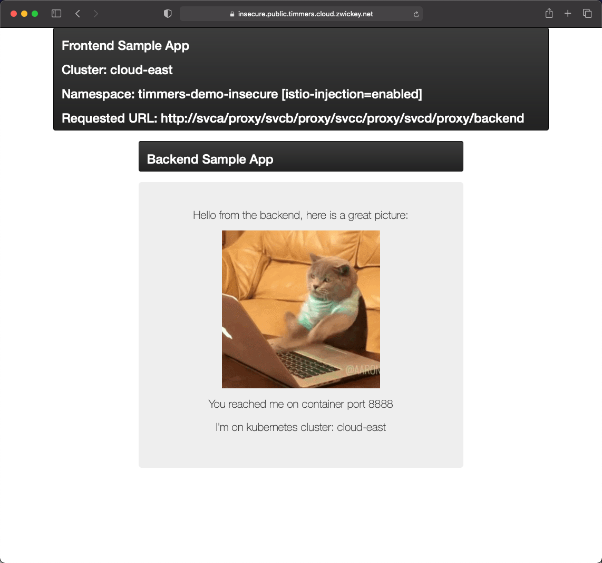
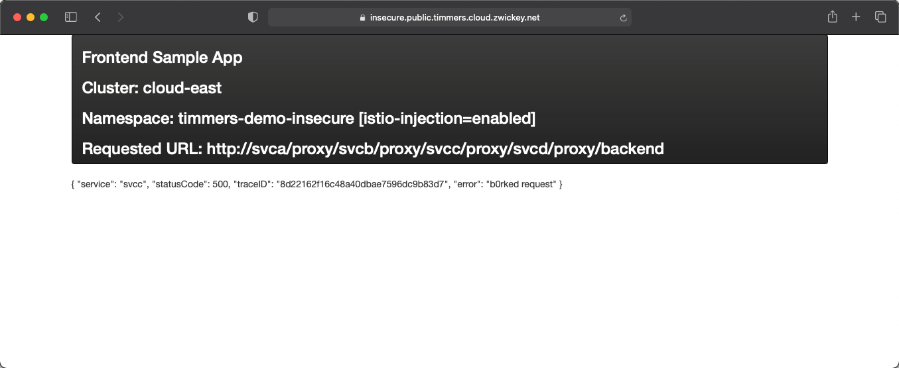
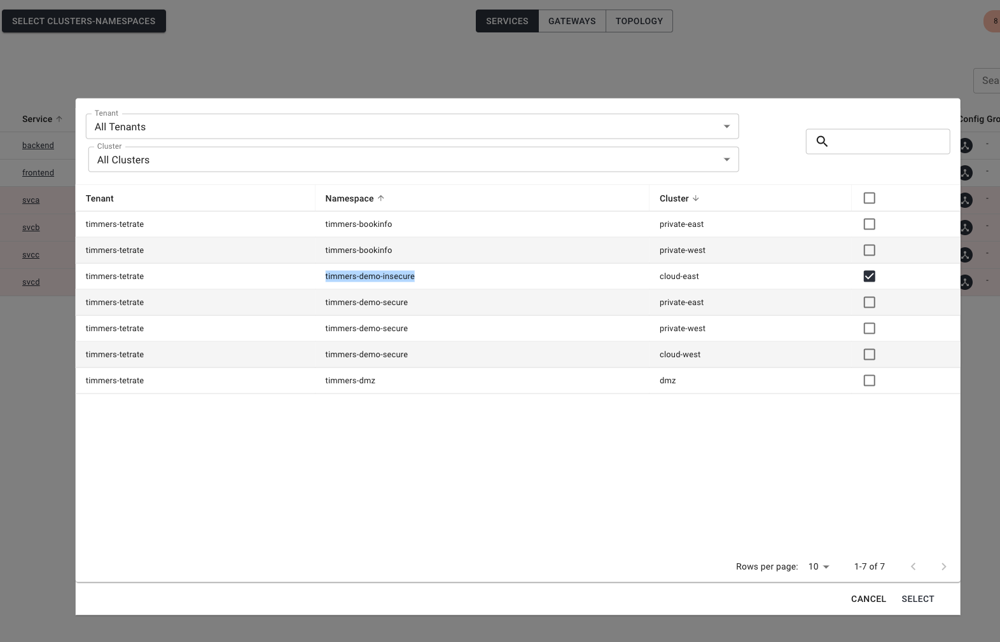
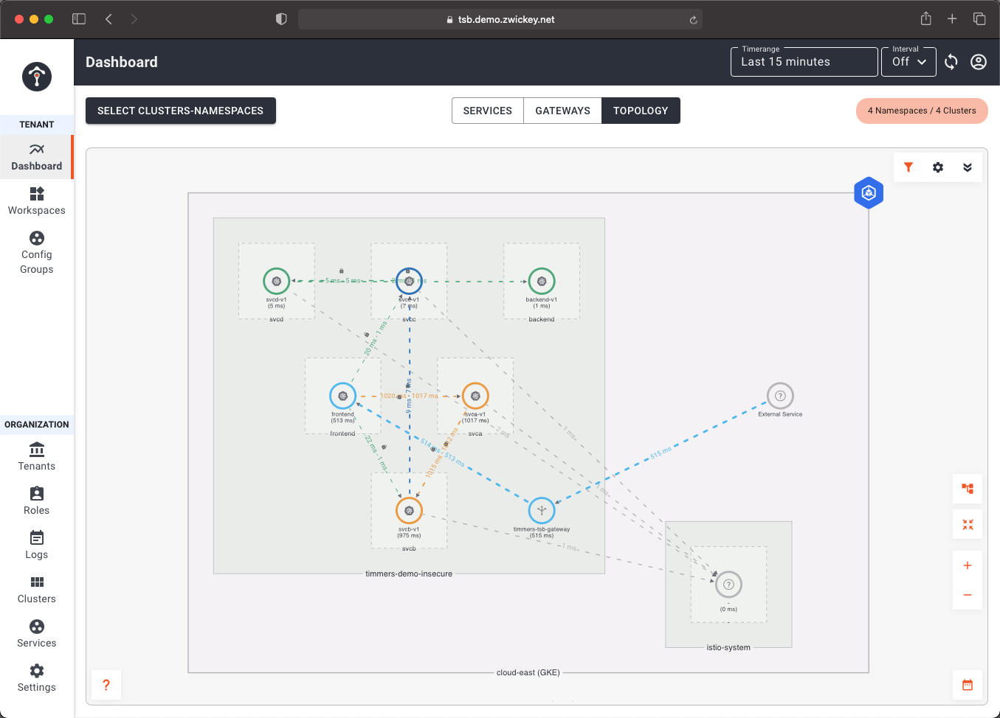
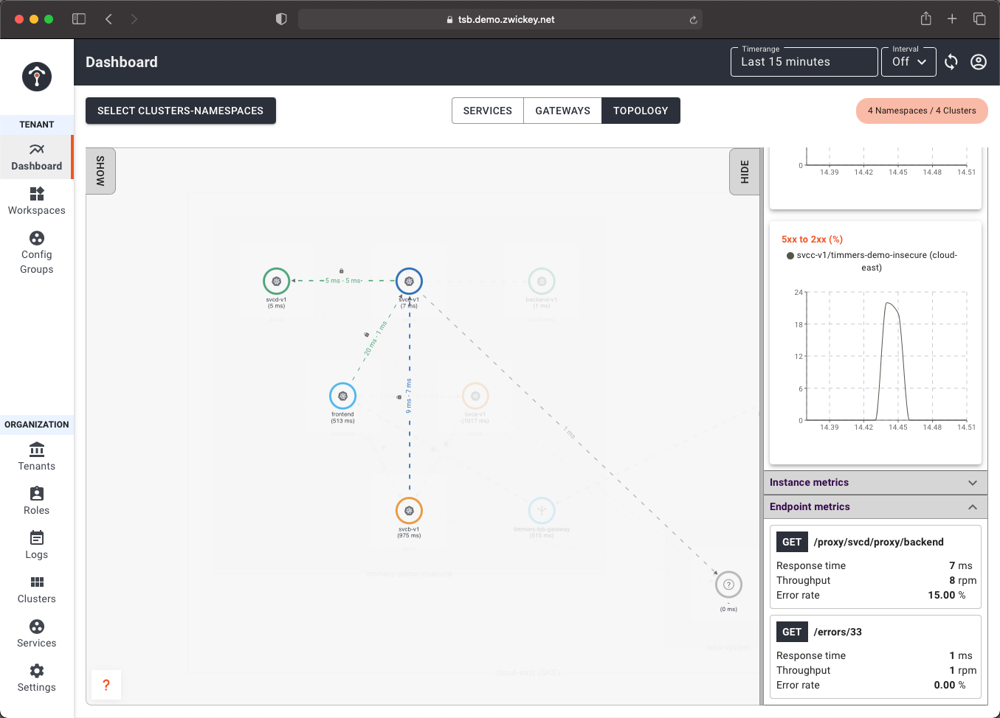
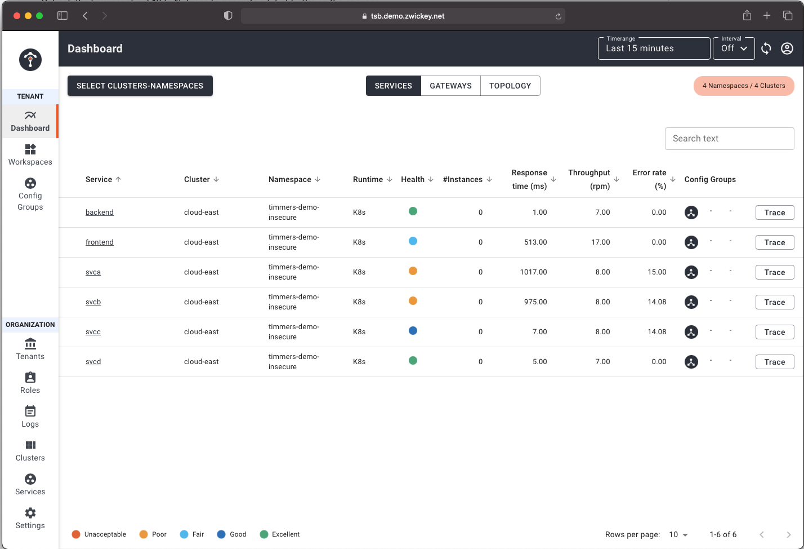
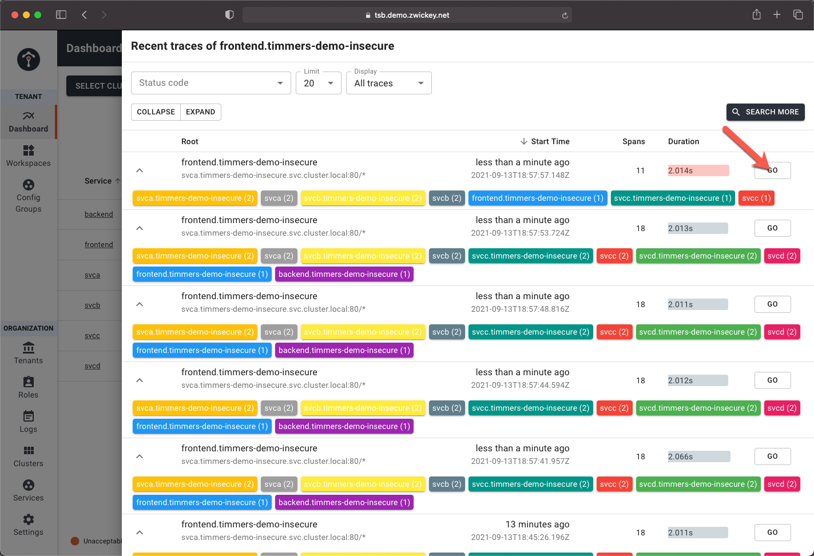
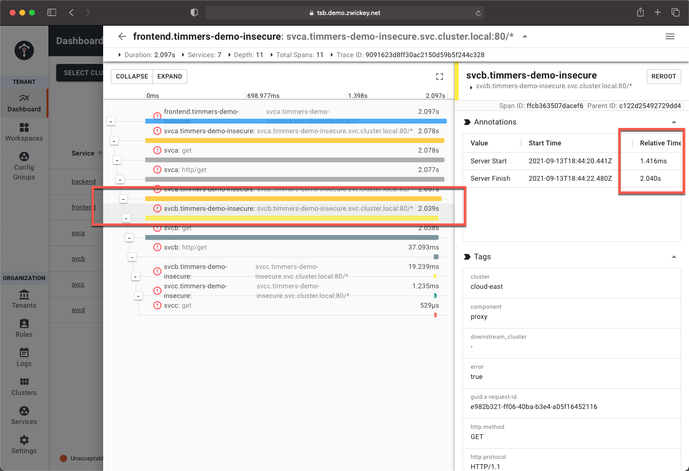
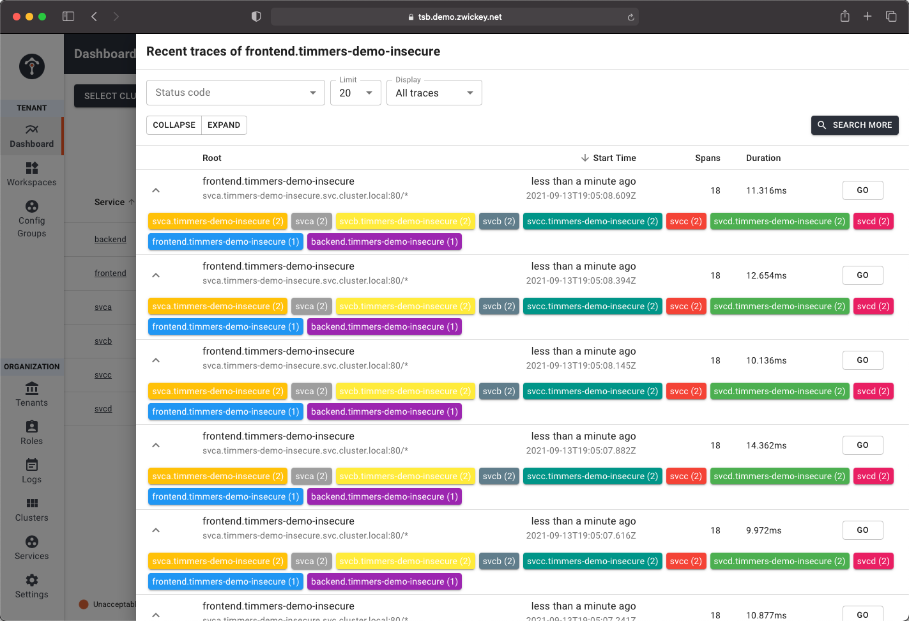
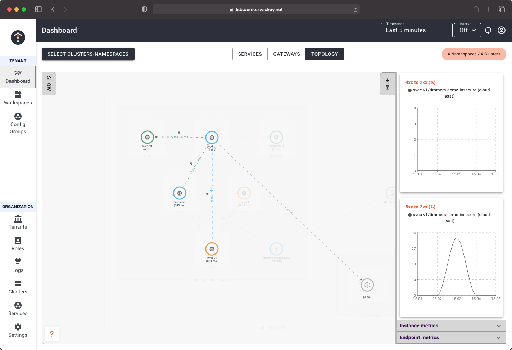

# Overview
One of the big benefits of a Service Mesh is the ability to gain insight into an application's behavior by collecting metrics, logs, and traces that are captured at the Envoy sidecar.  In this lab we will see how TSB can assist application owners in debugging and troubleshooting application issues.

## Deploy the Application

- First we will need to deploy another helper application that can be used to simulate a misbehaving application and also demonstrate a more complex chain of microservices that call each other.  We will be configuring this in the `public-east` cluster, our insecure cluster.  Deploy the sample proxy application using `kubectl apply`:

```bash
SVCNAME=svca envsubst < 07-Debugging/00-app.yaml | kubectl --context public-east apply -f -
SVCNAME=svcb envsubst < 07-Debugging/00-app.yaml | kubectl --context public-east apply -f -
SVCNAME=svcc envsubst < 07-Debugging/00-app.yaml | kubectl --context public-east apply -f -
SVCNAME=svcd envsubst < 07-Debugging/00-app.yaml | kubectl --context public-east apply -f -
```
- We can test our proxied application from our Frontend application that we have been utilizing throughout this workshop.  Open your browser and navigate to https://insecure.public.$PREFIX.cloud.zwickey.net.  Replace $PREFIX in the URL with your prefix value.  The application should display in your browser.  Enter the follwing address in the Backend HTTP URL text box:  `svca/proxy/svcb/proxy/svcc/proxy/svcd/proxy/backend`.  This will kickoff a microservice to microservice call chain that will traverse `svca -> svcb -> svcc -> svcd` before finally invoking our `backend` microservice.



Refresh the browser about 10 to 15 times to generate a bit of traffic on the services.

- Next we will configure 2 of the services to have a bit of latency and also return some errors for a small percentage of requests.  Execute the following `curl` commands, which will set a few properties on `svcb` and `svcc` to simulate failures:

```bash
curl -k https://insecure.public.$PREFIX.cloud.zwickey.net/proxy/\?url\=svcc%2Ferrors%2F33\&auth\=\&cachebuster\=123
curl -k https://insecure.public.$PREFIX.cloud.zwickey.net/proxy/\?url\=svcb%2Flatency%2F2000\&auth\=\&cachebuster\=123
```

- Return to you browser and refresh the page 10-15 more times.  You'll notice a bit of latency on the requests and some of the request may return errors.



## Troubleshoot Using TSB
Now lets utilize the TSB applicatoion to troubleshoot and debug our application.  If you don't already have it open, navigate a new browser tab to `https://tsb.demo.zwickey.net/admin/login`.  Select `Log in with OIDC` and when prompted enter your TSB credentials.  These can be found in the shared google sheet that you obtained jumpbox information from.  Once logged you will be routed to the Dashboard view.  You'll want to limit the services displayed to just the services we've been recently invoking.  Click the `SELECT CLUSTERS-NAMESPACES` button and select clusters/namespaces for `<PREFIX>-demo-insecure`, which is in the `cloud-east` cluster.



- From the TSB Dashboard view, click on `Topology` within the menu near in the top-middle portion of the screen.  Here you will see all you services' communication outlined and also color coded via AppDex score indicating application hotspots.



In our scenario `svcb` was configured to have latency and `svcc` was configured to return 500 HTTP  response codes errors for a portion of requests.  Click on the icon for `svcc` and you'll note we can view detailed R.E.D Metrics: Response, Error Rate, and Duration/Latency.  Additionally, this information is aggregated by API endpoint.



- Return to the Service List view of the Dashboard by clicking on `Services` within the menu near in the top-middle portion of the screen.  Here you will see table that displays similar R.E.D metrics for all services.  This can help us pinpoint that some services are experiencing latency and also a higher error rate.  



- Imagine that you simply had a report that "The Frontend service is slow and has errors".  This view can help pinpoint which microservice has errors.   Distributed Tracing will also assist if it is not immediately evident which microservice is the culprit.  On the far right-hand side of the screen click on the `Trace` button for our Frontend service.

This opens up a view of traces that are being collected in the system.  Any trace displayed that has the duration highlighted in red represents a request that resulted in a non-200 HTTP Response Code.  You can limit the traces displayed to only error traces by changing the value in the `Display` text box or by selecting a specific http response code filter in the `Status Code` drop down.  However, we do not have many traces so it should be easy to find an error trace.  Once you do, click the `Go` button to view the trace details.



- Click the `Expand` button new the top to reveal all microservices that contain a `span` for the distributed trace we are exploring.  From here we are able to pinpoint 2 concrete issues.  First, we can see that processing within `svcb` took slightly over 2 seconds!



Secondly, we can see that the `svcc` http GET request returned an 500 error code.


- Let remove the simulated failures for the microservices.  Execute the following `curl` commands:

```bash
curl https://insecure.public.$PREFIX.cloud.zwickey.net/proxy/\?url\=svcc%2Ferrors%2F0\&auth\=\&cachebuster\=123
curl https://insecure.public.$PREFIX.cloud.zwickey.net/proxy/\?url\=svcb%2Flatency%2F0\&auth\=\&cachebuster\=456
```

- Return to the browser tab that has the Frontend application open and refresh 10-15 times.  You should no longer receive any HTTP errors and the latency should be gone.

- Return the the TSB UI and refresh that browser page.  Once again click on the `Trace` button for the Frontend service.  Sort the traces by start time in descending order by clicking on the `start time` column heading.  You'll see that there are no longer any error traces and all frontend calls are responding with a latency of only a few milliseconds.  Our app is now healthy!



- Lastly, reurn to the Topology view by clicking on `Topology` within the menu near in the top-middle portion of the screen.  Once again click on the icon for `svcc` and you'll now see that the R.E.D. metrics no longer show errors or latency API calls.


