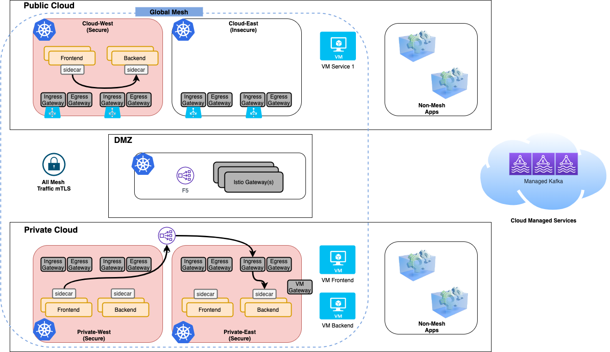
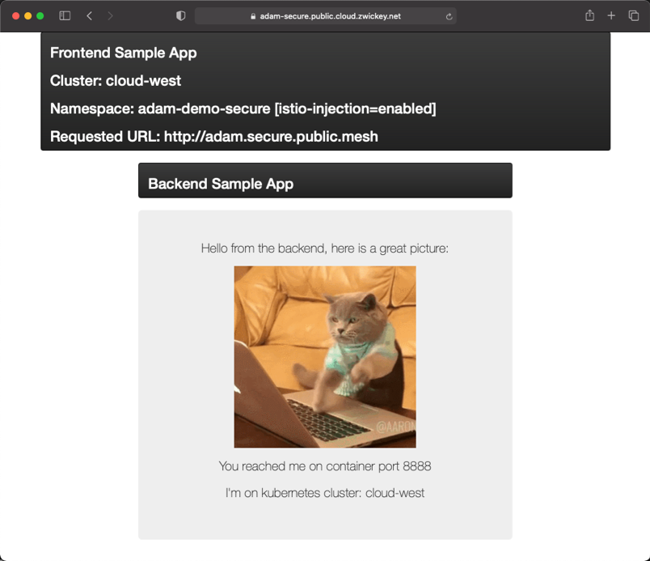
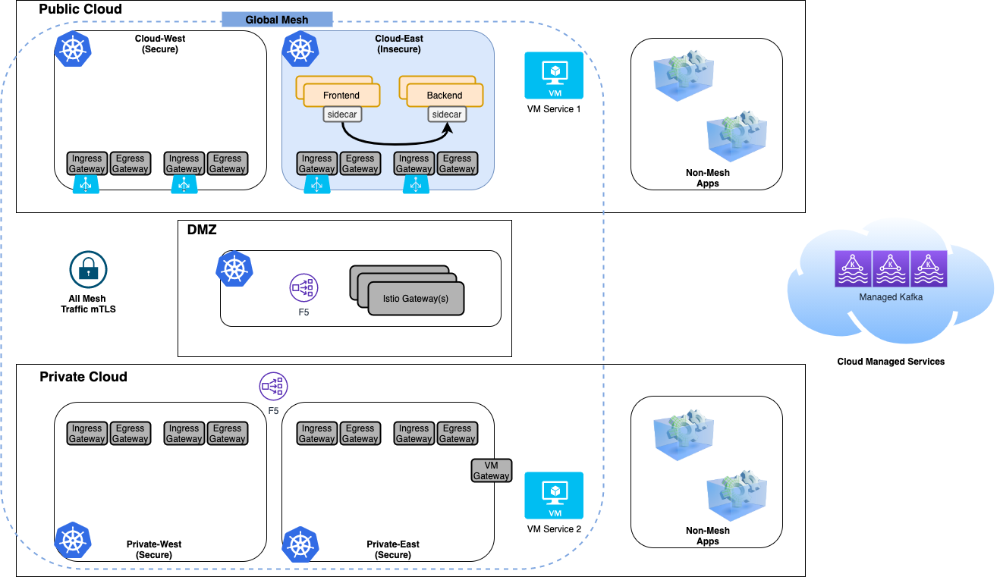
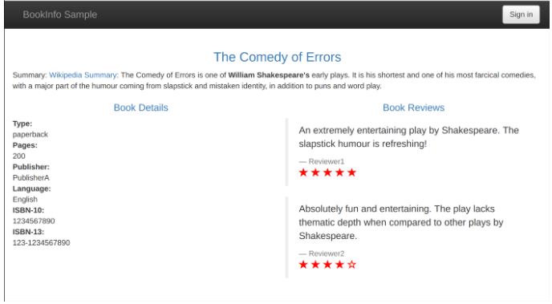
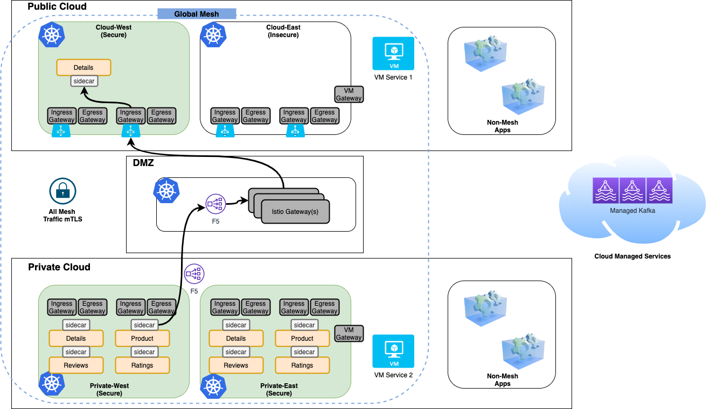

# Overview
This workshop provides Platform Operators, Application Developers, and Application Operators with hands on experience deploying and securing multi-cloud applications utilizing Tetrate Service Bridge.  Includeed are presentations, demos and hands on labs.

The target state infrastucture archiecture is comprised of 5 kubernetes clusters:
- 2 clusters in the public cloud deployed in an east region and a west region
- 2 clusters on-premises deployed in an east region and a west region.  Within the "east" region we will add legacy VM workloads to the env.
- One cluster deployed in a "DMZ" that facilitates a controlled point for securing communication traversing public and private clouds.

## Workshop Topics
IMPORTANT: Each new exercise builds upon the preceding lab, so please do not skip around the labs!

- Deploy Applications: [Lab](00-App-Deployment/README.md)
- Setup Multi-Tenancy: Slides [Lab](01-Tenancy/README.md)
- Application Config: Slides [Lab](02-App-Config/README.md)
- Security Policies: Slides [Lab](03-Security/README.md)
- Legacy VM Workloads: Slides [Lab](04-VM/README.md)
- Multi-Cloud & Multi-Cluster Traffic Mgmt: Slides [Lab](05-LB/README.md)
- Application Debugging: Slides [Lab](05-Debugging/README.md)
- Envoy Filters: Slides [Lab](06-Envoy/README.md)

## Applications

During this workshop we will be modeling 3 different applications that allow for various architecture and security patterns that span Multi-Cluster and Multi-Cloud.

### Secure Application
A simple frontend and backend application that allows simple testing of mesh networking and security.  This application spans the Public Cloud West cluster and both on-premises clusters.  This application also has VM versions of the services running in the private east region.

### Insecure Application
Identical application to the `Secure Application`, except it is only deployed into the Public Cloud East cluster, which we will utilize as the Insecure Cluster.

### Multi-Cluster Bookinfo Application
This is the canonical [Istio demo application, Bookinfo.](https://istio.io/latest/docs/examples/bookinfo/)  The microservice application displays information about a book, similar to a single catalog entry of an online book store.  This application spans is fully deployed to both on-premises clusters and only one of its microservices deployed to the Public Cloud West cluster.  In this manner, we can demonstrate advanced routing and service discovery patterns.

## Prerequisites & Environment Setup
xxx
Notes on deployment... emv var for envsubst